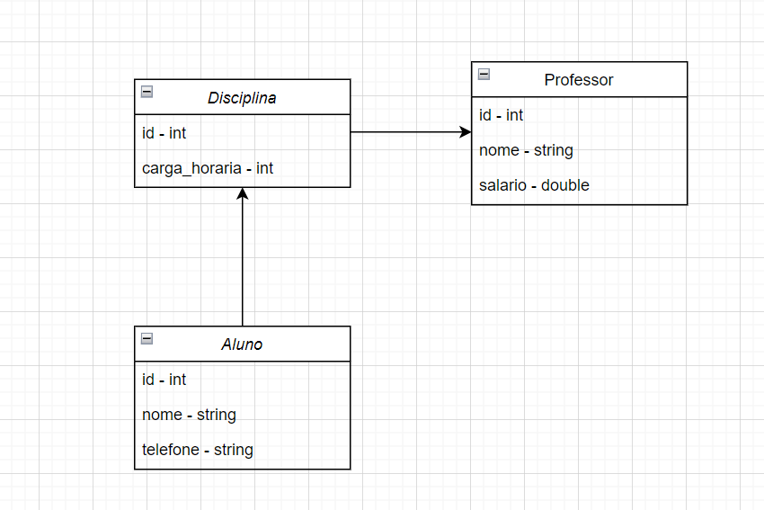

## Modelagem Realizada

Cada entidade possui telas feitas com Java Swing para operações de CRUD.

#### O arquivo persistence.xml está sendo ignorado para não exibir informações pessoais

A modelagem do sistema incluiu as seguintes entidades e seus relacionamentos:

